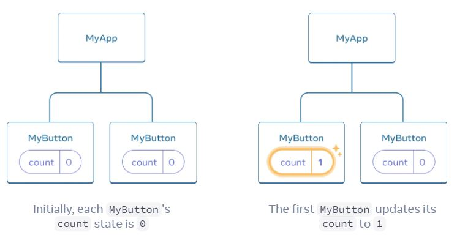
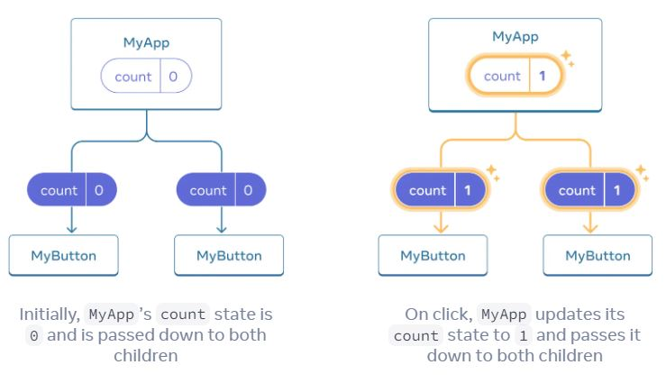

# Using hooks 

Functions starting with `use` are called *Hooks*. `useState` is a built-in Hook provided by React. You can find other built-in Hooks in the [API reference](https://react.dev/reference/react). You can also write your own Hooks by combining the existing ones.

Hooks are more restrictive than other functions. You can only call Hooks *at the top* of your components (or other Hooks). If you want to use `useState` in a condition or a loop, extract a new component and put it there.

## Sharing data between components

In the previous example, each `MyButton` had its own independent `count`, and when each button was clicked, only the `count` for the button clicked changed:

 

However, often you’ll need components to *share data* and *always update together*.

To make both `MyButton` components display the same `count` and update together, you need to move the state from the individual buttons “upwards” to the closest component containing all of them.



Now when you click either button, the `count` in `MyApp` will change, which will change both of the counts in `MyButton`. Here’s how you can express this in code.

```html
<!-- index.html -->

<html lang="en">
    <head>
        <title>Using hooks</title>

        <meta charset="utf-8"/>
        <meta name="viewport" content="width=device-width, initial-scale=1"/>
        <meta name="description" content="Using hooks"/>
        <meta name="author" content="Peter Olum"/>

        <script src="https://unpkg.com/react@18/umd/react.development.js" defer></script>
        <script src="https://unpkg.com/react-dom@18/umd/react-dom.development.js" defer></script>
        <script src="https://unpkg.com/@babel/standalone/babel.min.js" defer></script>
        <script src="./script/App.jsx" type="text/jsx" defer></script>
    </head>
    <body>
        <div id="app">

        </div>
    </body>
</html>
```

```jsx
// scripts/App.jsx


const app = document.getElementById("app");
const root = ReactDOM.createRoot(app);

root.render(
    <>
        <h1>Using Hooks </h1>
        <MyApp />
    </>
);

function MyApp() {
    const [count, setCount] = React.useState(0);

    function handleClick() {
        setCount(count + 1);
    }

    return (
        <>
            <MyButton count={count} onClick={handleClick} />
            <MyButton count={count} onClick={handleClick} />
        </>
    )
}

function MyButton({count, onClick}) {
    return (
        <div>
            <h2>{`You clicked button below ${count} times`}</h2>
            <button onClick={onClick}>Click me</button>
        </div>
    );
}
```

When you click the button, the `onClick` handler fires. Each button’s onClick prop was set to the `handleClick` function inside MyApp, so the code inside of it runs. That code calls `setCount(count + 1)`, incrementing the count state variable. The new `count` value is passed as a prop to each button, so they all show the new value. This is called “lifting state up”. By moving state up, you’ve shared it between components.

## How you can access this live website

<dl>
  Use the following URL:
  <dd>
    https://olumpeter.github.io/react-projects/009-using-hooks/
  </dd>
  or click the following link:
  <dd>
    <a href="https://olumpeter.github.io/react-projects/009-using-hooks/">Visit website</a>
  </dd>
</dl>

